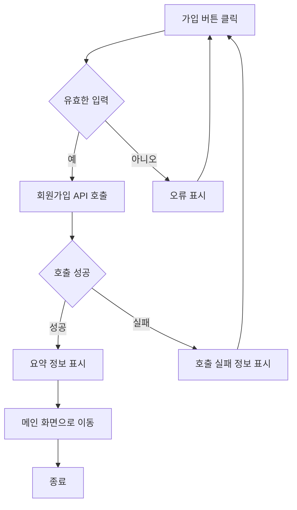
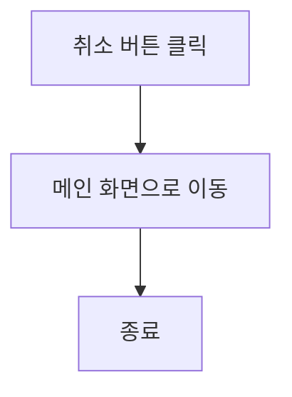
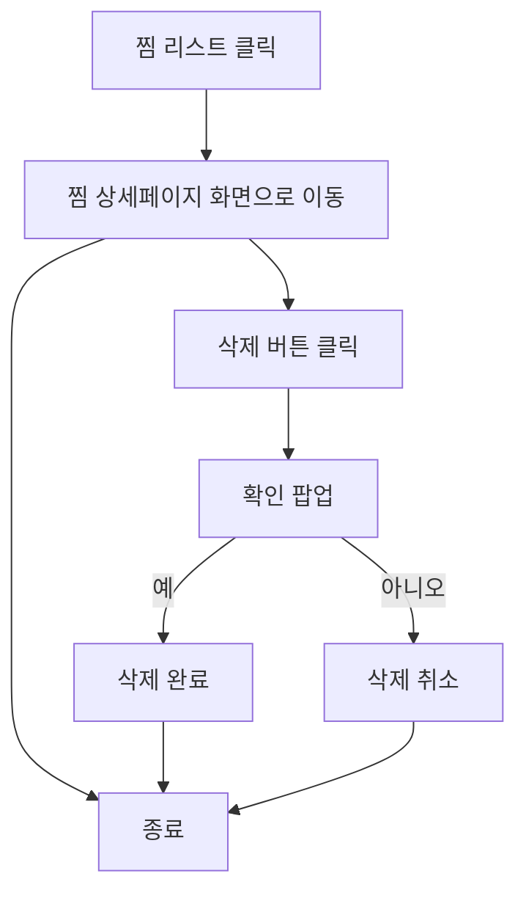
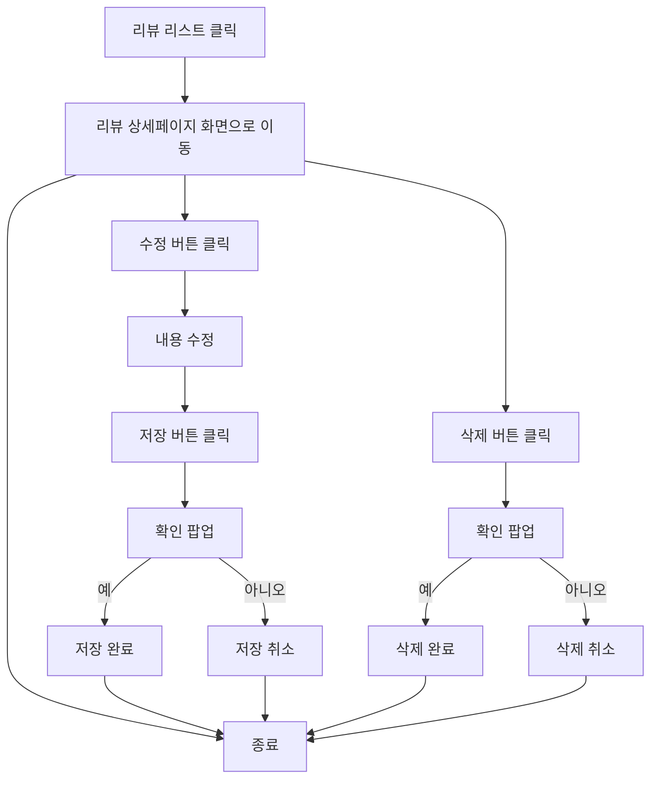
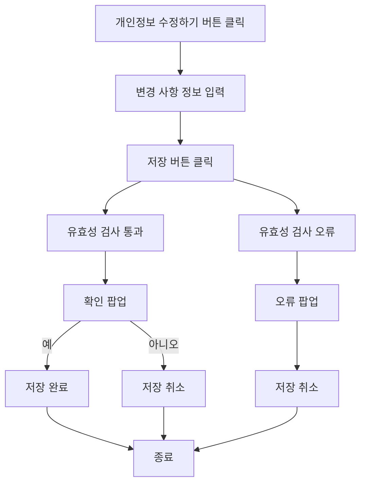
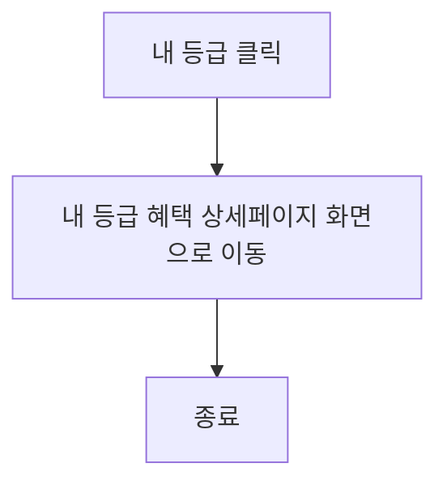

# 기능 정의서

프로젝트 정의서의 사용자 스토리를 기반으로 세부 기능을 구체적으로 정의합니다.

(⭐️ 예시 시작) 지우지 말아 주세요, 마지막 병합 후에 지우면 될 것 같아요!
## 계정 관리 사용자 스토리

### 사용자로서, 나는 서비스에 회원가입을 하고 싶습니다. 이후 로그인을 진행하여 서비스를 이용할 수 있습니다.

#### 1. 기능명 : 회원가입

* 기능 설명
  * 사용자가 회원 정보를 입력하고 서비스에 가입을 할 수 있다.
* 입력 항목
  * 이메일 : 문자열, 최대 50자 (유효성 검사 필요)
  * 이름: 문자열, 최대 50자
  * 주민등록번호: 문자열, 13자 (유효성 검사 필요)
  * 비밀번호: 문자열, 최소 10자
  * 비밀번호 확인 : 문자열, 최소 10자 (비밀번호와 일치 여부 확인 필요)

##### 1.1 사용자 액션

##### 가입

* 가입 버튼 클릭
  * 입력 항목 유효성 검사 실행
  * 유효성 검사 오류 발생시 등록 절차는 종료되며 사용자에게 오류 정보 알림
  * 유효성 검사 통과시 회원가입 API 호출
  * API 호출 성공 후 요약 정보 표시
  * 메인 화면으로 전환

---

* 취소 버튼 클릭
  * 메인 화면으로 전환

(⭐️ 예시 끝) 지우지 말아 주세요, 마지막 병합 후에 지우면 될 것 같아요!

(⭐️ 아래 부터 각자 작업하시면 됩니다.)
## 마이페이지 관리 사용자 스토리

### 사용자로서, 나는 찜 목록을 확인하고 관리하고 싶습니다.

#### 1. 기능명 : 찜 리스트

* 기능 설명
  * 사용자가 찜 목록을 확인하고 삭제할 수 있다.

##### 1.1 사용자 액션

### 사용자로서, 내가 쓴 리뷰 목록을 확인하고 관리하고 싶습니다.

#### 2. 기능명 : 리뷰 리스트

* 기능 설명
  * 사용자가 내가 쓴 리뷰 목록을 확인하고 수정,삭제할 수 있다.

##### 2.1 사용자 액션

### 사용자로서, 나는 내 개인정보를 수정하고 싶습니다.

#### 3. 기능명 : 개인정보 수정

* 기능 설명
  * 사용자가 내 개인정보를 확인하고 수정할 수 있다.
* 입력 항목
  * 비밀번호 : 문자열, 최소 10자
  * 비밀번호 확인 : 문자열, 최소 10자 (비밀번호와 일치 여부 확인 필요)

##### 3.1 사용자 액션

##### 수정

* 수정 버튼 클릭
  * 입력 항목 유효성 검사 실행
  * 유효성 검사 오류 발생시 등록 절차는 종료되며 사용자에게 오류 정보 알림
  * 유효성 검사 통과시 수정 가능 정보 알림
  * 수정 버튼 클릭시 변경 내용 저장
  * 마이페이지 화면으로 전환

### 사용자로서, 나는 내 등급과 혜택을 확인하고 싶습니다.

#### 4. 기능명 : 사용자 등급 확인

* 기능 설명
  * 사용자가 내 등급과 혜택을 확인할 수 있다.

##### 4.1 사용자 액션

