# 기능 정의서

프로젝트 정의서의 사용자 스토리를 기반으로 세부 기능을 구체적으로 정의합니다.

(⭐️ 예시 시작) 지우지 말아 주세요, 마지막 병합 후에 지우면 될 것 같아요!

## 계정 관리 사용자 스토리

### 사용자로서, 나는 서비스에 회원가입을 하고 싶습니다. 이후 로그인을 진행하여 서비스를 이용할 수 있습니다.

#### 1. 기능명 : 회원가입

- 기능 설명
  - 사용자가 회원 정보를 입력하고 서비스에 가입을 할 수 있다.
- 입력 항목
  - 이메일 : 문자열, 최대 50자 (유효성 검사 필요)
  - 이름: 문자열, 최대 50자
  - 주민등록번호: 문자열, 13자 (유효성 검사 필요)
  - 비밀번호: 문자열, 최소 10자
  - 비밀번호 확인 : 문자열, 최소 10자 (비밀번호와 일치 여부 확인 필요)

##### 1.1 사용자 액션

##### 가입

- 가입 버튼 클릭
  - 입력 항목 유효성 검사 실행
  - 유효성 검사 오류 발생시 등록 절차는 종료되며 사용자에게 오류 정보 알림
  - 유효성 검사 통과시 회원가입 API 호출
  - API 호출 성공 후 요약 정보 표시
  - 메인 화면으로 전환

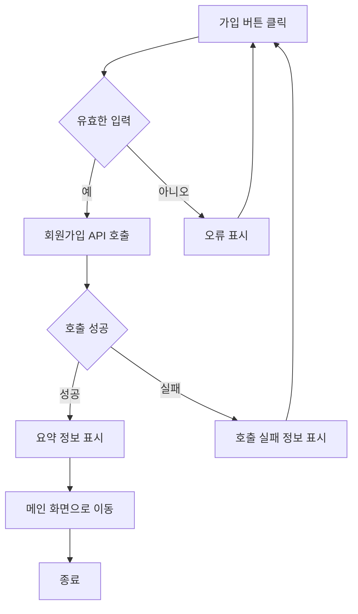

---

- 취소 버튼 클릭
  - 메인 화면으로 전환

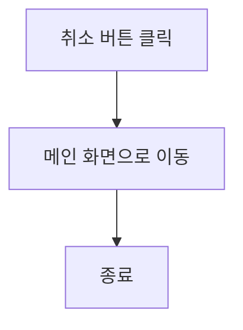

(⭐️ 예시 끝) 지우지 말아 주세요, 마지막 병합 후에 지우면 될 것 같아요!

(⭐️ 아래 부터 각자 작업하시면 됩니다.)

### **1. 기능명 : 회원가입**

#### **기능 설명**

사용자가 회원 정보를 입력하여 계정을 생성할 수 있습니다.

#### **입력 항목**

- **이메일** : 문자열, 최대 50자 (유효성 검사 필요)
- **이름**: 문자열, 최대 50자
- **주민등록번호**: 문자열, 13자 (유효성 검사 필요)
- **비밀번호**: 문자열, 최소 10자
- **비밀번호 확인** : 문자열, 최소 10자 (비밀번호와 일치 여부 확인 필요)

#### **사용자 액션**

##### **가입 버튼 클릭**

1. 사용자가 모든 입력 항목을 작성합니다.
2. 입력 항목의 유효성을 검사합니다.
   - 이메일 혈식 검증
   - 이름 길이 검증
   - 비밀번호와 비밀번호 확인의 일치 여부 확인
3. 유효성 검사에 실패하면 오류 정보를 표시하고 절차를 종료합니다.
4. 유효성 검사를 통과하면 회원가입 API를 호출합니다.
5. API 호출 성공 시 요약 정보를 표시하고 로그인 화면으로 전환합니다.
6. API 호출 실패 시 오류 정보를 표시합니다.

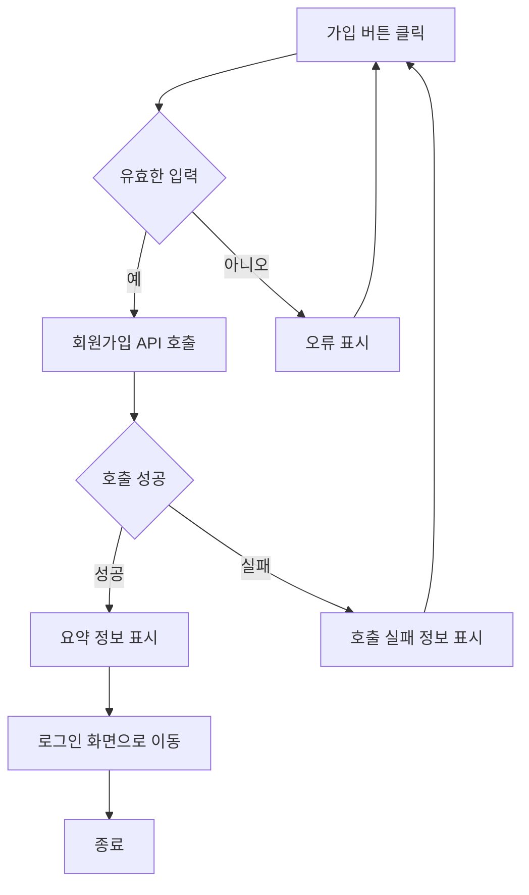

##### **취소 버튼 클릭**

1. 사용자가 취소 버튼을 클릭하면 로그인 화면으로 이동합니다.

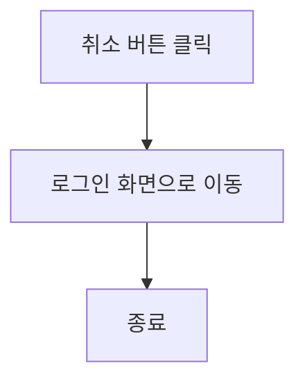

---

### **2. 기능명 : 로그인**

#### **기능 설명**

- 사용자가 이메일과 비밀번호를 입력하여 로그인할 수 있습니다.

#### **입력 항목**

- **이메일**: 문자열, 최대 50자 (유효성 검사 필요)
- **비밀번호**: 문자열, 최소 10자 (유효성 검사 필요)

#### **사용자 액션**

##### **로그인 버튼 클릭**

1. 사용자가 이메일과 비밀번호를 입력합니다.
2. 입력 항목의 유효성을 검사합니다.
   - 이메일 형식 검증
   - 비밀번호 길이 검증
3. 유효성 검사에 실패하면면 오류 정보를 표시하고 절차를 종료합니다.
4. 유효성 검사를 통과하면 로그인 API를 호출합니다.
5. API 호출 성공 시 메인 화면으로 전환합니다.
6. API 호출 실패 시 오류 정보를 표시합니다.

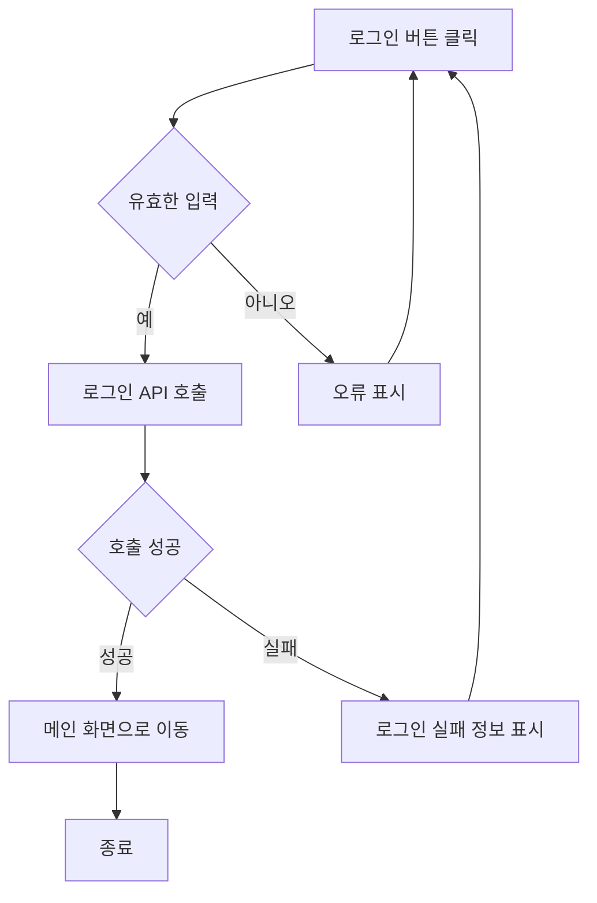

##### **취소 버튼 클릭**

1. 사용자가 취소 버튼을 클릭하면 메인 화면으로 이동합니다.

---

### **3. 기능명 : 개인정보 수정**

#### **기능 설명**

- 사용자가 본인의 계정 정보를 수정할 수 있습니다.
- 비밀번호 확인을 통해 본인 인증을 완료해야 수정이 가능합니다.

#### ** 입력 항목**

- **비밀번호**: 문자열, 최소 10자(변경시)

#### **사용자 액션**

##### **수정 버튼 클릭**

1. 사용자가 비밀번호 확인 정보를 입력합니다.
2. 입력항목의 유효성을 검사합니다.
   - 비밀번호 확인의 유효성 및 일치 여부 검증
3. 유효성 검사에 실패하면 오류 정보를 표시하고 절차를 종료합니다.
4. 유효성 검사에 통과하면 개인정보 수정 API를 호출합니다.
5. API 호출 성공 시 수정 완료 메세지를 표시하고 메인 마이페이지 화면으로 전환합니다.
6. API 호출 실패 시 오류 정보를 표시합니다.

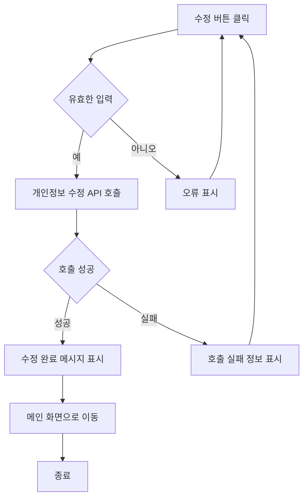

##### **취소 버튼 클릭**

1. 사용자가 취소 버튼을 클릭하면 마이페이지 화면으로 이동합니다.

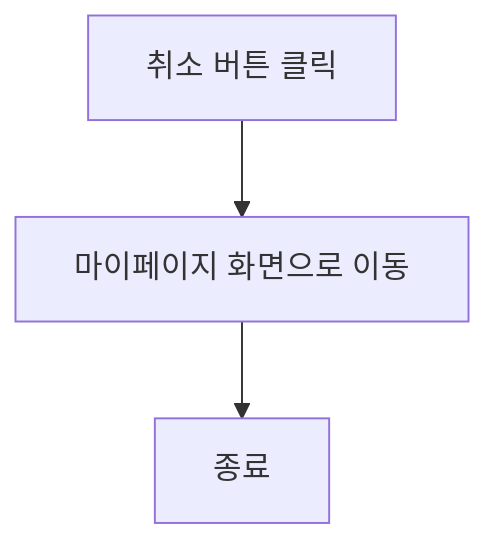

---

### **4. 기능명: 계정 삭제**

#### **기능 설명**

- 사용자가 본인의 계정을 삭제할 수 있습니다.
- 삭제 전 비밀번호 확인 절차를 거칩니다.

#### ** 입력 항목**

- **비밀번호**: 문자열, 최소 10자(삭제시)

#### **사용자 액션**

##### **삭제 버튼 클릭**

1. 사용자가 비밀번호 확인 정보를 입력합니다.
2. 입력 항목의 유효성을 검사합니다.
   - 비밀번호 확인의 유효성 및 일치 여부 검증
3. 유효성 검사에 실패하면 오류 정보를 표시하고 절차를 종료합니다.
4. 유효성 검사에 통과하면 개인정보 수정 API를 호출합니다.
5. API 호출 성공 시 수정 완료 메세지를 표시하고 로그인 화면으로 전환합니다.
6. API 호출 실패 시 오류 정보를 표시합니다.

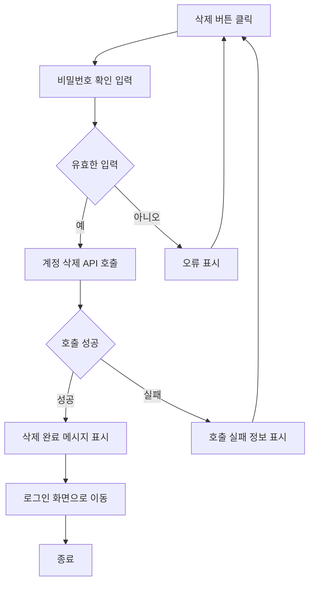

##### **취소 버튼 클릭**

1. 사용자가 취소 버튼을 클릭하면 마이페이지 화면으로 이동합니다.

---

---

## **기능명: 매장 정보 확인**

### **기능 설명**

사용자가 특정 맛집을 클릭하면 해당 매장의 기본적인 정보를 확인할 수 있습니다.  
**주소**, **영업시간**, **전화번호**, **예약 방식** 등을 포함한 상세 정보를 제공합니다.

### **기능 항목**

#### **1. 매장 기본 정보**

- **주소**: 매장의 위치를 나타내는 상세 주소 (지도 연동 가능).
- **영업시간**: 매장의 오픈 및 종료 시간 정보 (요일별로 표시).
- **전화번호**: 매장의 연락 가능한 번호.
- **기타 정보**: 매장의 주요 특징, 인기 메뉴 등.

#### **2. 예약 정보 제공**

- **예약 방식**: 매장 예약 방법에 대한 상세 안내 제공.
  - **전화 예약**: 전화번호와 예약 가능 시간을 함께 표시.
  - **온라인 예약**: 예약 가능한 플랫폼(앱/웹) 링크 제공.
  - **현장 예약**: 별도 예약 없이 현장 방문으로 안내.

#### **3. 지도 연동 및 길찾기 기능**

- **지도 연동**: 매장의 위치를 지도 위에 표시합니다.
- **간편 길찾기**:
  - 현재 위치를 기반으로 매장까지의 경로를 검색.
  - 자동차, 대중교통, 도보 등의 옵션 제공.
  - 선택한 경로를 외부 지도 앱(예: Google Maps, Naver Maps, Kakao Maps)과 연동하여 안내.

### **사용자 스토리**

1. 사용자가 검색 결과에서 특정 맛집을 클릭합니다.
2. 해당 매장의 상세 정보를 확인할 수 있는 페이지로 이동합니다.
3. 다음 정보를 확인할 수 있습니다:
   - 매장 주소 및 지도 연동
   - 영업시간 (요일별 구분)
   - 전화번호
   - 예약 가능한 방식
   - 간편한 길찾기 기능
   - 기타 제공 정보 (리뷰, 추천 메뉴 등)
4. 사용자가 예약을 진행하려는 경우, 제공된 예약 방법(전화/온라인)을 통해 연결됩니다.
5. 사용자가 길찾기를 원할 경우 지도에서 길찾기 옵션을 선택하고 외부 지도 앱으로 연동됩니다.

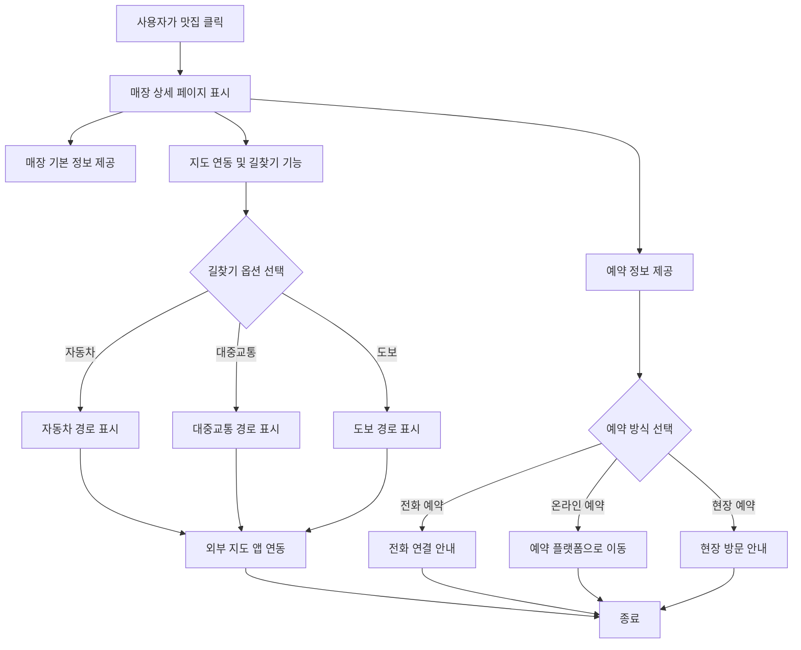

---

---

## 마이페이지 관리 사용자 스토리

### 사용자로서, 나는 찜 목록을 확인하고 관리하고 싶습니다.

#### 1. 기능명 : 찜 리스트

- 기능 설명
  - 사용자가 찜 목록을 확인하고 삭제할 수 있다.

##### 1.1 사용자 액션

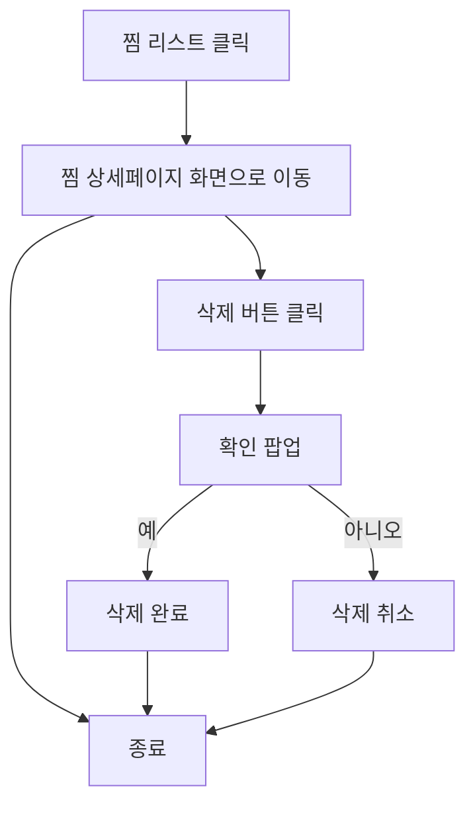

### 사용자로서, 내가 쓴 리뷰 목록을 확인하고 관리하고 싶습니다.

#### 2. 기능명 : 리뷰 리스트

- 기능 설명
  - 사용자가 내가 쓴 리뷰 목록을 확인하고 수정,삭제할 수 있다.

##### 2.1 사용자 액션

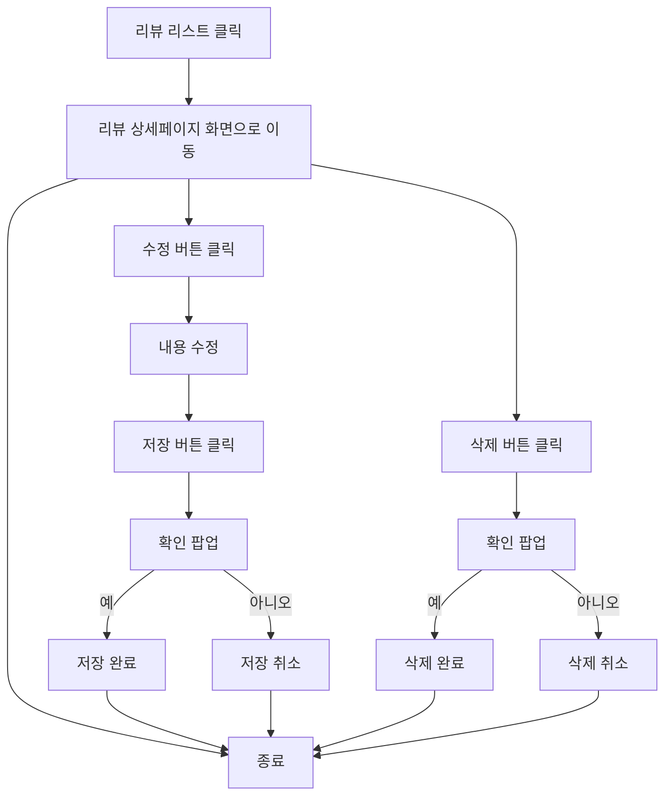

### 사용자로서, 나는 내 개인정보를 수정하고 싶습니다.

#### 3. 기능명 : 개인정보 수정

- 기능 설명
  - 사용자가 내 개인정보를 확인하고 수정할 수 있다.
- 입력 항목
  - 비밀번호 : 문자열, 최소 10자
  - 비밀번호 확인 : 문자열, 최소 10자 (비밀번호와 일치 여부 확인 필요)

##### 3.1 사용자 액션

##### 수정

- 수정 버튼 클릭
  - 입력 항목 유효성 검사 실행
  - 유효성 검사 오류 발생시 등록 절차는 종료되며 사용자에게 오류 정보 알림
  - 유효성 검사 통과시 수정 가능 정보 알림
  - 수정 버튼 클릭시 변경 내용 저장
  - 마이페이지 화면으로 전환

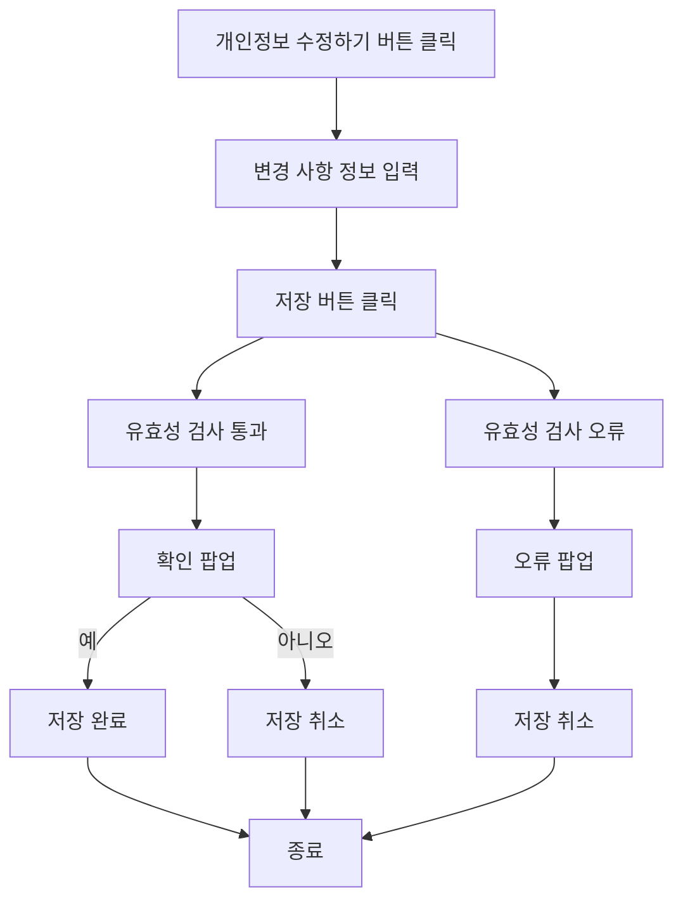

### 사용자로서, 나는 내 등급과 혜택을 확인하고 싶습니다.

#### 4. 기능명 : 사용자 등급 확인

- 기능 설명
  - 사용자가 내 등급과 혜택을 확인할 수 있다.

##### 4.1 사용자 액션

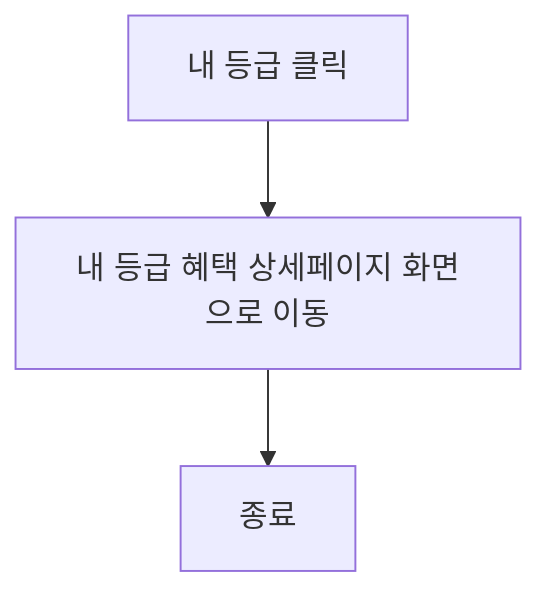

---

## GPS 기반 검색 사용자 스토리

### 사용자로서, 나는 현재 위치를 기준으로 가까운 맛집을 검색하고 싶습니다.

#### 1. 기능명: GPS 기반 검색

- 기능 설명
  - 현재 위치를 기반으로 음식점에 대한 정보를 제공합니다.
- 권한 요청
  - 사용자의 위치 기반 GPS 허용 : 항상 허용하기 / 앱을 사용할 때만 허용하기
- 불러올 항목
  - 가게 ID : 고유 식별자

##### 1.1 사용자 액션

- GPS 활성화
  - 사용자가 GPS를 활성화해야 지도에 현재 위치를 표시할 수 있음
- 지도 렌더링
  - 현재 위치를 기준으로 기본 줌 수준(예: 반경 1km)을 가진 지도를 띄움
- 지도 상호작용
  - 사용자가 지도를 드래그하거나 확대/축소하면 새로운 범위를 계산
- 데이터 요청
  - 사용자가 보고 있는 지도 뷰포트를 기준으로 서버에 맛집 데이터를 요청
- 핀 표시
  - 서버에서 반환된 데이터(맛집 정보)를 지도에 핀으로 표시
- 사용자 선택
  - 사용자가 핀을 클릭하면 가게 정보를 확인할 수 있음(예: 메뉴, 리뷰, 주소 등)
- 추가 상호작용
  - 관심 있는 가게의 상세 정보를 제공하거나, 다른 가게를 선택

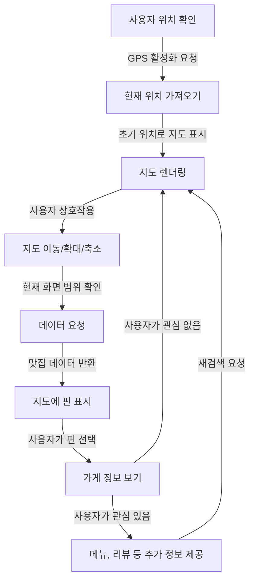

## AI 기반 추천 사용자 스토리

### 사용자로서, 나는 간단한 텍스트 입력으로 맞춤형 맛집 추천을 받고 싶습니다.

#### 2. 기능명: AI기반 추천

- 기능 설명
  - 챗봇을 통해 사용자의 요구와 선호도에 맞는 음식점 추천 서비스를 제공합니다.
- 입력 항목
  - 사용자 텍스트 입력 : 문자열, 최대 100자로 자연어 형태로 입력 가능 (예: "크리스마스에 커플이 갈 만한 분위기 좋은 성수 이탈리안 맛집 추천해줘.")

##### 2.1 사용자 액션

- 사용자 입력
  - 텍스트 입력 : ex. "크리스마스에 커플이 갈 만한 분위기 좋은 성수 이탈리안 맛집 추천해줘."
- 입력 처리
  - 자연어 처리 (NLP): 사용자의 문장에서 중요한 키워드 추출 (ex. ”크리스마스”, "커플", "성수", "이탈리안", "분위기 좋은")
- 사용자 프로필 분석
  - 사용자의 선호도 데이터, 과거 기록과 비교
- 추천 엔진 작동
  - 필터링: 위치(성수), 음식 종류(이탈리안), 분위기 및 조건
  - 데이터베이스 조회: 해당 조건에 맞는 음식점 정보 탐색
- 추천 생성
  - 음식점 3~5개 선정: 이름, 위치, 특징(분위기, 메뉴 등) 정리
- 결과 전달
  - 매장 정보와 함께 챗봇 응답 생성 후 다시 추천 요청 플래그 Boolean (True/False)

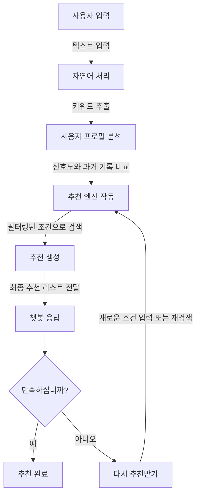

## 맛집 카테고리 검색 사용자 스토리

### 사용자로서, 나는 여러 방송 속에 나온 맛집을 보고 싶습니다.

#### 3. 기능명: 카테고리 기반 검색

- 기능 설명
  - 제공되는 여러 카테고리 중 사용자가 원하는 분류를 직접 선택해 맛집 정보를 탐색할 수 있게 합니다.
- 선택 항목
  - 분류 label : 카테고리 구분 위한 데이터베이스 속 label
  - 가게 ID : 고유 식별자

##### 3.1 사용자 액션

- 탭 선택
  - 첫 단계에서 방송/유튜브/가이드북 또는 음식 분류를 선택
- 세부 선택
  - 방송/유튜브/가이드북 선택 시: 방송/유튜브/가이드북 세부 선택 이후 음식 분류 선택 단계로 진행
  - 음식 분류 선택 시: 음식 분류 세부 선택 이후 방송/유튜브/가이드북 선택 단계로 진행
- 리스트 표시
  - 선택한 세부 카테고리에 따라 API 호출 후 맛집 리스트를 표시
- 가게 정보 확인
  - 리스트 중 하나를 클릭하면 가게 상세 정보를 확인
- 추가 정보 확인 및 반복 탐색
  - 사용자 추가 이벤트 요청에 따라 메뉴, 리뷰 등을 제공하거나 다른 카테고리로 이동해 탐색 가능

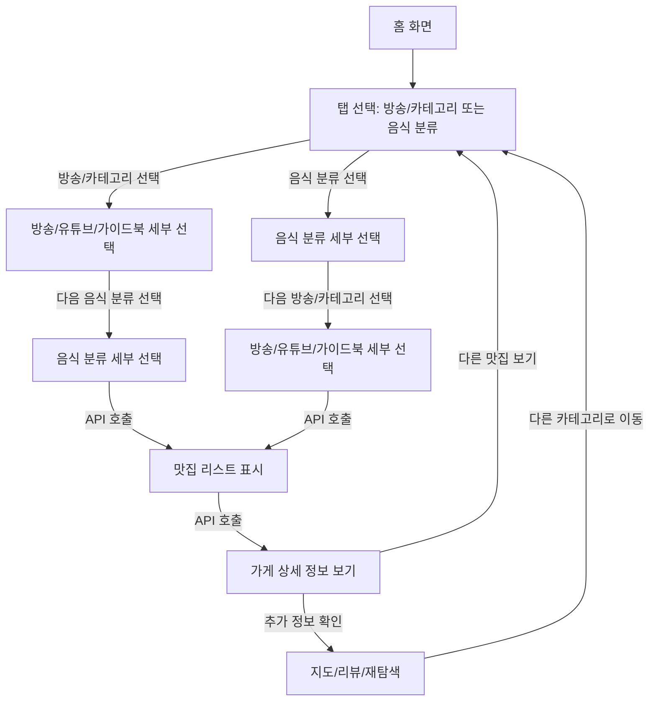
