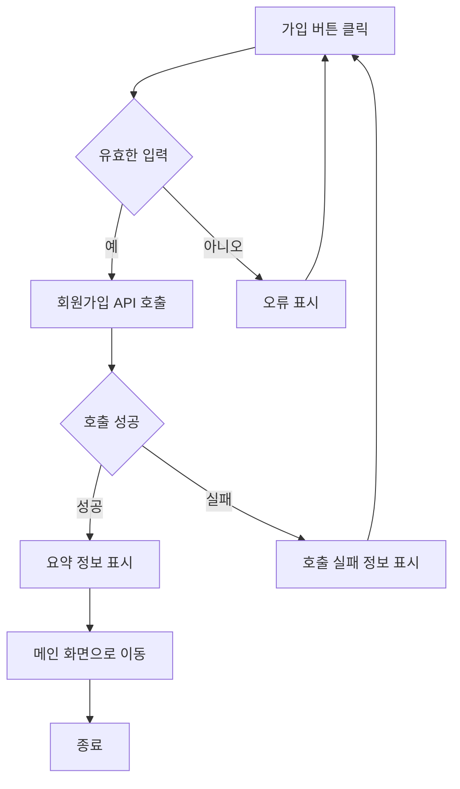
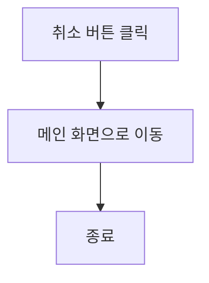

# 기능 정의서

프로젝트 정의서의 사용자 스토리를 기반으로 세부 기능을 구체적으로 정의합니다.

(⭐️ 예시 시작) 지우지 말아 주세요, 마지막 병합 후에 지우면 될 것 같아요!

## 계정 관리 사용자 스토리

### 사용자로서, 나는 서비스에 회원가입을 하고 싶습니다. 이후 로그인을 진행하여 서비스를 이용할 수 있습니다.

#### 1. 기능명 : 회원가입

- 기능 설명
  - 사용자가 회원 정보를 입력하고 서비스에 가입을 할 수 있다.
- 입력 항목
  - 이메일 : 문자열, 최대 50자 (유효성 검사 필요)
  - 이름: 문자열, 최대 50자
  - 주민등록번호: 문자열, 13자 (유효성 검사 필요)
  - 비밀번호: 문자열, 최소 10자
  - 비밀번호 확인 : 문자열, 최소 10자 (비밀번호와 일치 여부 확인 필요)

##### 1.1 사용자 액션

##### 가입

- 가입 버튼 클릭
  - 입력 항목 유효성 검사 실행
  - 유효성 검사 오류 발생시 등록 절차는 종료되며 사용자에게 오류 정보 알림
  - 유효성 검사 통과시 회원가입 API 호출
  - API 호출 성공 후 요약 정보 표시
  - 메인 화면으로 전환

---

- 취소 버튼 클릭
  - 메인 화면으로 전환

(⭐️ 예시 끝) 지우지 말아 주세요, 마지막 병합 후에 지우면 될 것 같아요!

(⭐️ 아래 부터 각자 작업하시면 됩니다.)

## 리뷰 및 평점관리 사용자 스토리

### 사용자로서, 나는 방문한 맛집에 대한 리뷰를 작성하고 싶습니다. 이후 작성한 리뷰를 수정, 삭제할 수 있습니다.

#### 1. 기능명 : 리뷰작성

- 기능 설명
  - 사용자가 선택한 식당에 대해 리뷰 글을 작성하고 저장할 수 있다.
- 입력 항목
  - 리뷰 제목: 문자열, 최대 100자 (유효성 검사 필요)
  - 리뷰 내용: 문자열, 최대 1000자 (유효성 검사 필요)
  - 별점: 정수, 1~5
  - 업로드 사진: 이미지 파일, 최대 5개 (선택 사항)

##### 1.1 사용자 액션

##### 리뷰 기본 정보 입력

- 리뷰작성 버튼 클릭
  - 입력 항목 유효성 검사 실행
  - 유효성 검사 오류 발생시 사용자에게 오류 정보 알림

---

##### 리뷰 작성 및 사진 업로드

- 다음 버튼 클릭
  - 입력 항목 유효성 검사 실행
  - 유효성 검사 오류 발생시 사용자에게 오류 정보 알림

---

##### 리뷰 제출

- 등록 버튼 클릭
  - 입력 항목 유효성 검사 실행
  - API 호출 성공 시 리뷰 저장, 확인 메시지 표시 및 메인 화면으로 이동
  - API 호출 실패 시 오류 메시지 표시

---

##### 리뷰 작성 취소

- 취소 버튼 클릭
  - 이전 화면으로 이동

---

#### 2. 기능명 : 리뷰수정

- 기능 설명
  - 사용자가 작성한 리뷰 글을 수정하고 저장할 수 있다.
- 입력 항목
  - 리뷰 제목: 문자열, 최대 100자 (유효성 검사 필요)
  - 리뷰 내용: 문자열, 최대 1000자 (유효성 검사 필요)
  - 별점: 정수, 1~5
  - 업로드 사진: 이미지 파일, 최대 5개 (선택 사항)

##### 2.1 사용자 액션

##### 리뷰 수정하기

- 리뷰 수정하기 버튼 클릭
  - 입력 항목 유효성 검사 실행
  - 유효성 검사 오류 발생시 사용자에게 오류 정보 알림
  - 유효성 검사 통과 시 리뷰 수정 API 호출

---

##### 리뷰 수정 취소

- 취소 버튼 클릭
  - 이전 화면으로 이동

---

#### 3. 기능명 : 리뷰삭제

- 기능 설명
  - 사용자가 작성한 리뷰를 삭제할 수 있다.

##### 3.1 사용자 액션

##### 리뷰 삭제

- 리뷰삭제 버튼 클릭
  - 삭제 확인 팝업 표시
  - 삭제 확인 시 리뷰 삭제 API 호출
  - API 호출 성공 시 확인 메시지 표시 및 이전 화면으로 이동
  - API 호출 실패 시 오류 메시지 표시
