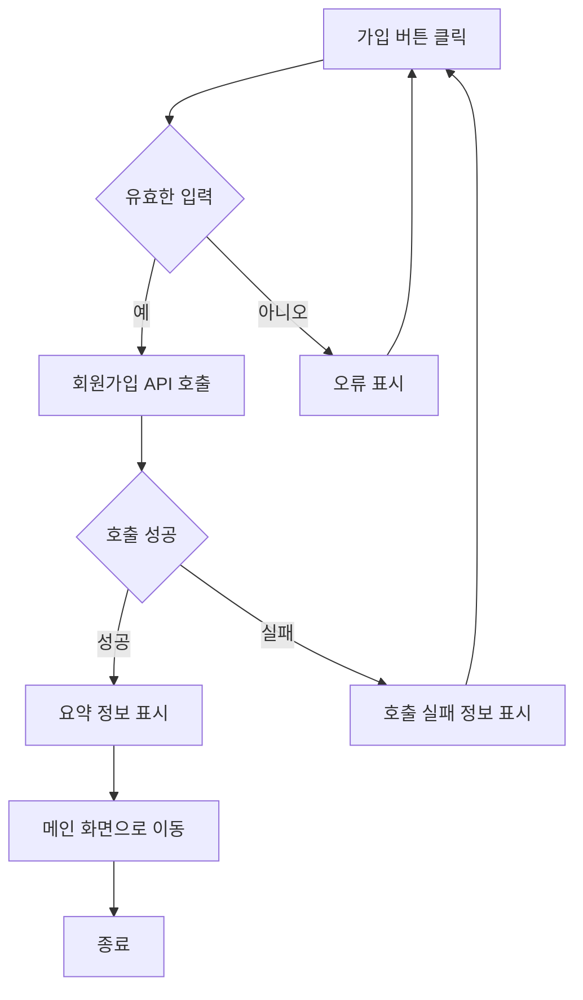
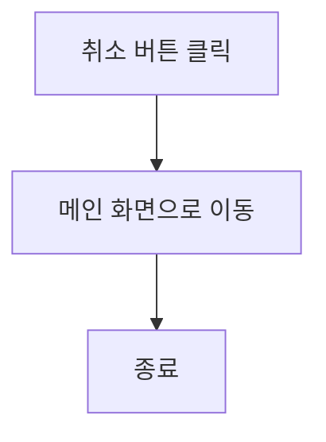
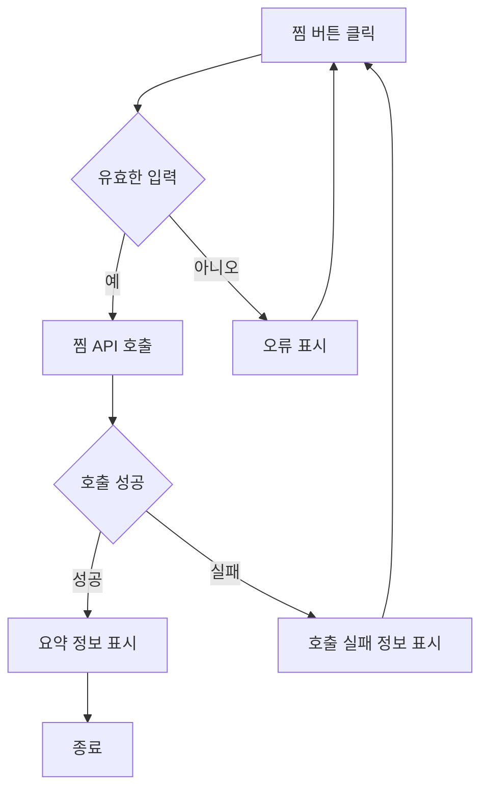

# 기능 정의서

프로젝트 정의서의 사용자 스토리를 기반으로 세부 기능을 구체적으로 정의합니다.

(⭐️ 예시 시작) 지우지 말아 주세요, 마지막 병합 후에 지우면 될 것 같아요!
## 계정 관리 사용자 스토리

### 사용자로서, 나는 서비스에 회원가입을 하고 싶습니다. 이후 로그인을 진행하여 서비스를 이용할 수 있습니다.

#### 1. 기능명 : 회원가입

* 기능 설명
  * 사용자가 회원 정보를 입력하고 서비스에 가입을 할 수 있다.
* 입력 항목
  * 이메일 : 문자열, 최대 50자 (유효성 검사 필요)
  * 이름: 문자열, 최대 50자
  * 주민등록번호: 문자열, 13자 (유효성 검사 필요)
  * 비밀번호: 문자열, 최소 10자
  * 비밀번호 확인 : 문자열, 최소 10자 (비밀번호와 일치 여부 확인 필요)

##### 1.1 사용자 액션

##### 가입

* 가입 버튼 클릭
  * 입력 항목 유효성 검사 실행
  * 유효성 검사 오류 발생시 등록 절차는 종료되며 사용자에게 오류 정보 알림
  * 유효성 검사 통과시 회원가입 API 호출
  * API 호출 성공 후 요약 정보 표시
  * 메인 화면으로 전환

---

* 취소 버튼 클릭
  * 메인 화면으로 전환

(⭐️ 예시 끝) 지우지 말아 주세요, 마지막 병합 후에 지우면 될 것 같아요!

(⭐️ 아래 부터 각자 작업하시면 됩니다.)

## 찜 사용자 스토리

### 사용자로서, 나는 특정 가게를 찜하거나 취소하고 싶습니다. 그래서 관심 있는 가게 목록을 최신 상태로 유지할 수 있습니다.
#### 1. 기능명: 찜

* 기능 설명
  * 사용자가 특정 가게를 찜하거나 취소함으로써 관심있는 가게 목록을 최신 상태로 유지할 수 있다.
* 입력 항목
  * 가게 ID: 고유식별자
  * 찜 여부: Boolean 타입

##### 1.1 사용자 액션

##### 찜등록 및 해제

* 찜 버튼 클릭
  * 입력 항목 유효성 검사 실행
  * 유효성 검사 오류 발생시 찜 절차는 종료되며 사용자에게 오류 정보 알림
  * 유효성 검사 통과시 찜 API 호출
  * API 호출 성공 후 요약 정보 표시

