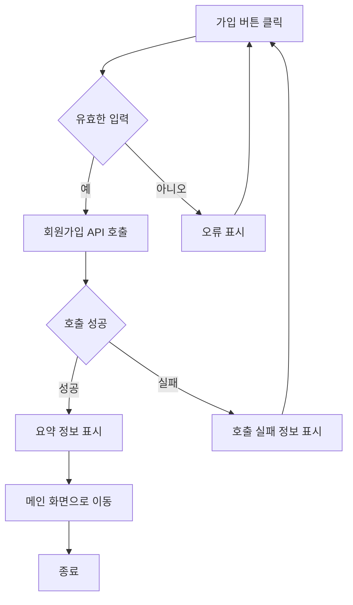
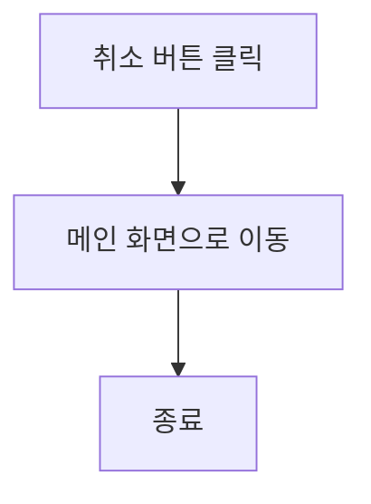
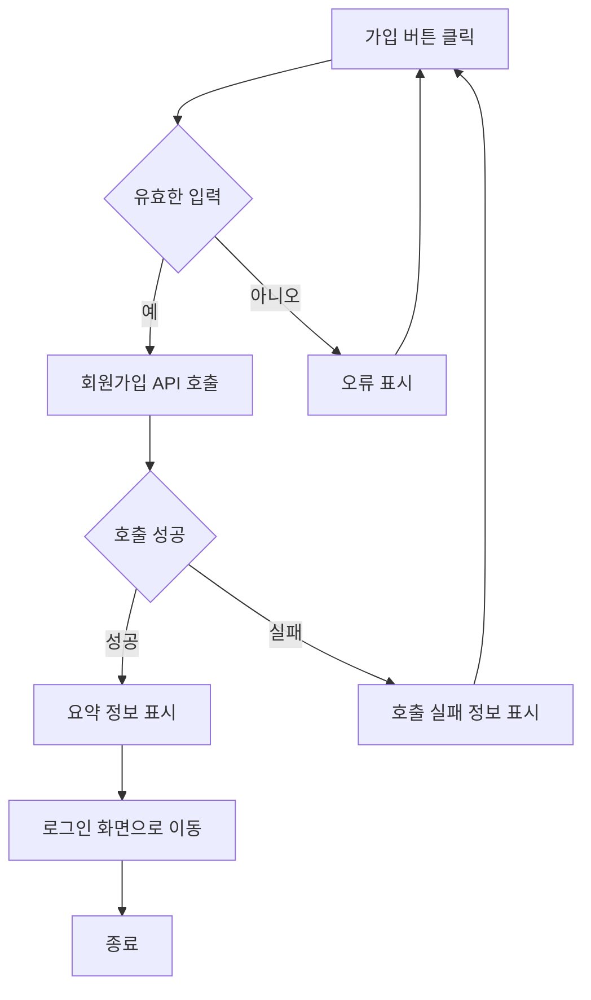
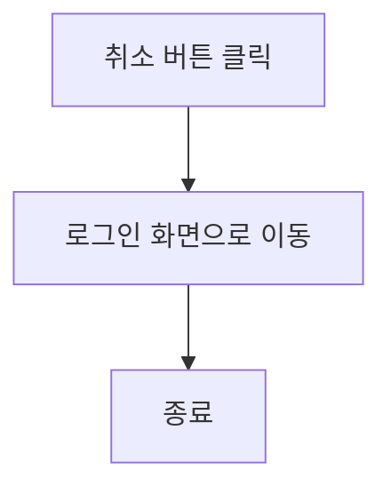
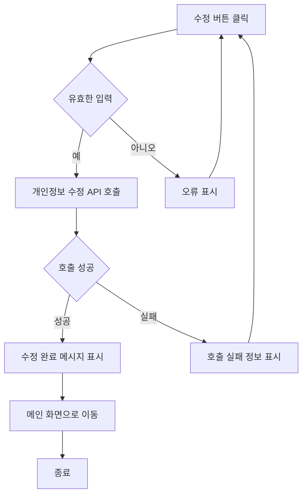
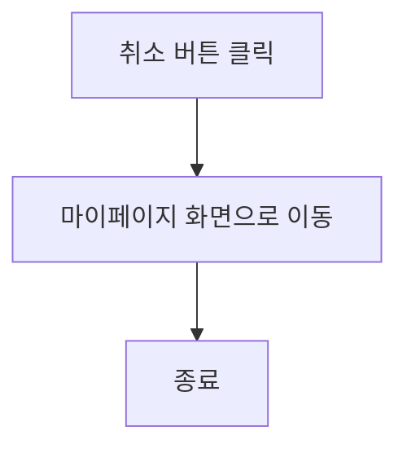
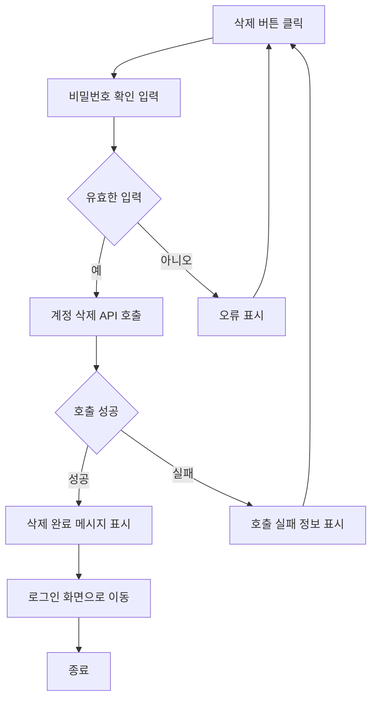

# 기능 정의서

프로젝트 정의서의 사용자 스토리를 기반으로 세부 기능을 구체적으로 정의합니다.

(⭐️ 예시 시작) 지우지 말아 주세요, 마지막 병합 후에 지우면 될 것 같아요!
## 계정 관리 사용자 스토리

### 사용자로서, 나는 서비스에 회원가입을 하고 싶습니다. 이후 로그인을 진행하여 서비스를 이용할 수 있습니다.

#### 1. 기능명 : 회원가입

* 기능 설명
  * 사용자가 회원 정보를 입력하고 서비스에 가입을 할 수 있다.
* 입력 항목
  * 이메일 : 문자열, 최대 50자 (유효성 검사 필요)
  * 이름: 문자열, 최대 50자
  * 주민등록번호: 문자열, 13자 (유효성 검사 필요)
  * 비밀번호: 문자열, 최소 10자
  * 비밀번호 확인 : 문자열, 최소 10자 (비밀번호와 일치 여부 확인 필요)

##### 1.1 사용자 액션

##### 가입

* 가입 버튼 클릭
  * 입력 항목 유효성 검사 실행
  * 유효성 검사 오류 발생시 등록 절차는 종료되며 사용자에게 오류 정보 알림
  * 유효성 검사 통과시 회원가입 API 호출
  * API 호출 성공 후 요약 정보 표시
  * 메인 화면으로 전환



---

* 취소 버튼 클릭
  * 메인 화면으로 전환


(⭐️ 예시 끝) 지우지 말아 주세요, 마지막 병합 후에 지우면 될 것 같아요!

(⭐️ 아래 부터 각자 작업하시면 됩니다.)
---

### **1. 기능명 : 회원가입**

#### **기능 설명**
사용자가 회원 정보를 입력하여 계정을 생성할 수 있습니다.

#### **입력 항목**
- **이메일** : 문자열, 최대 50자 (유효성 검사 필요)
- **이름**: 문자열, 최대 50자
- **주민등록번호**: 문자열, 13자 (유효성 검사 필요)
- **비밀번호**: 문자열, 최소 10자
- **비밀번호 확인** : 문자열, 최소 10자 (비밀번호와 일치 여부 확인 필요)

#### **사용자 액션**

##### **가입 버튼 클릭**
1. 사용자가 모든 입력 항목을 작성합니다.
2. 입력 항목의 유효성을 검사합니다.
    - 이메일 혈식 검증
    - 이름 길이 검증
    - 비밀번호와 비밀번호 확인의 일치 여부 확인
3. 유효성 검사에 실패하면 오류 정보를 표시하고 절차를 종료합니다.
4. 유효성 검사를 통과하면 회원가입 API를 호출합니다.
5. API 호출 성공 시 요약 정보를 표시하고 로그인 화면으로 전환합니다.
6. API 호출 실패 시 오류 정보를 표시합니다.



##### **취소 버튼 클릭**
1. 사용자가 취소 버튼을 클릭하면 로그인 화면으로 이동합니다.



---

### **2. 기능명 : 로그인**

#### **기능 설명**
- 사용자가 이메일과 비밀번호를 입력하여 로그인할 수 있습니다.

#### **입력 항목**
- **이메일**: 문자열, 최대 50자 (유효성 검사 필요)  
- **비밀번호**: 문자열, 최소 10자 (유효성 검사 필요)

#### **사용자 액션**

##### **로그인 버튼 클릭**
1. 사용자가 이메일과 비밀번호를 입력합니다.
2. 입력 항목의 유효성을 검사합니다.
   - 이메일 형식 검증
   - 비밀번호 길이 검증
3. 유효성 검사에 실패하면면 오류 정보를 표시하고 절차를 종료합니다.
4. 유효성 검사를 통과하면 로그인 API를 호출합니다.
5. API 호출 성공 시 메인 화면으로 전환합니다.
6. API 호출 실패 시 오류 정보를 표시합니다.

```mermaid
flowchart TD
    A[로그인 버튼 클릭] --> B[입력 항목 유효성 검증]
    B{유효한 입력} -- 예 --> C[로그인 API 호출]
    B{유효한 입력} -- 아니오 --> D[오류 표시]
    D --> A
    C --> E{호출 성공}
    E -- 성공 --> F[메인 화면으로 이동]
    E -- 실패 --> G[로그인 실패 정보 표시]
    G --> A
    F --> Z[종료]
 ```

##### **취소 버튼 클릭**
1. 사용자가 취소 버튼을 클릭하면 메인 화면으로 이동합니다.

```mermaid
flowchart TD
    A[취소 버튼 클릭] --> B[메인 화면으로 이동]
    B --> Z[종료]
```

---

### **3. 기능명 : 개인정보 수정**

#### **기능 설명**
- 사용자가 본인의 계정 정보를 수정할 수 있습니다.
- 비밀번호 확인을 통해 본인 인증을 완료해야 수정이 가능합니다.

#### ** 입력 항목**
- **비밀번호**: 문자열, 최소 10자(변경시)

#### **사용자 액션**

##### **수정 버튼 클릭**
1. 사용자가 비밀번호 확인 정보를 입력합니다.
2. 입력항목의 유효성을 검사합니다.
    - 비밀번호 확인의 유효성 및 일치 여부 검증
3. 유효성 검사에 실패하면 오류 정보를 표시하고 절차를 종료합니다.
4. 유효성 검사에 통과하면 개인정보 수정 API를 호출합니다.
5. API 호출 성공 시 수정 완료 메세지를 표시하고 메인 마이페이지 화면으로 전환합니다.
6. API 호출 실패 시 오류 정보를 표시합니다.



##### **취소 버튼 클릭**
1. 사용자가 취소 버튼을 클릭하면 마이페이지 화면으로 이동합니다.



---

### **4. 기능명: 계정 삭제**

#### **기능 설명**
- 사용자가 본인의 계정을 삭제할 수 있습니다.
- 삭제 전 비밀번호 확인 절차를 거칩니다.

#### ** 입력 항목**
- **비밀번호**: 문자열, 최소 10자(삭제시)

#### **사용자 액션**

##### **삭제 버튼 클릭**
1. 사용자가 비밀번호 확인 정보를 입력합니다.
2. 입력 항목의 유효성을 검사합니다.
    - 비밀번호 확인의 유효성 및 일치 여부 검증
3. 유효성 검사에 실패하면 오류 정보를 표시하고 절차를 종료합니다.
4. 유효성 검사에 통과하면 개인정보 수정 API를 호출합니다.
5. API 호출 성공 시 수정 완료 메세지를 표시하고 로그인 화면으로 전환합니다.
6. API 호출 실패 시 오류 정보를 표시합니다.



##### **취소 버튼 클릭**
1. 사용자가 취소 버튼을 클릭하면 마이페이지 화면으로 이동합니다.


---


